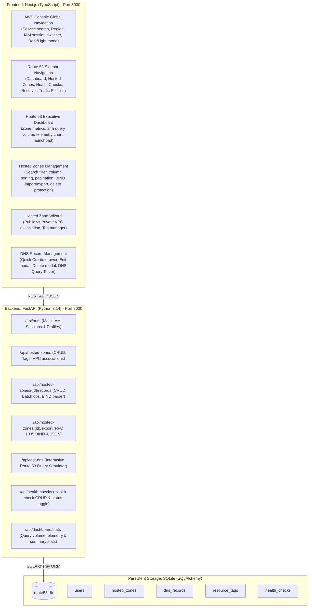
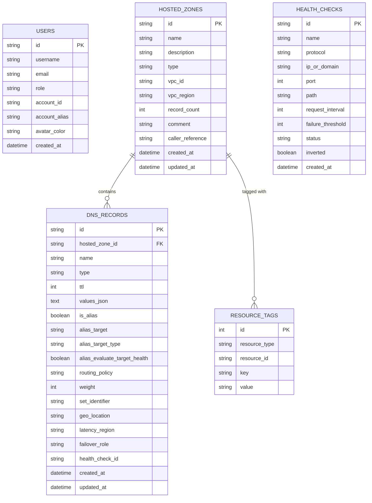

# AWS Route 53 Web Application Clone

A full-stack, pixel-perfect clone of the **Amazon Route 53** Domain Name System (DNS) web service built with **Next.js 14+ (TypeScript)**, **FastAPI (Python 3)**, and **SQLite (SQLAlchemy)**. Designed strictly to match the look, feel, and interactive workflows of the **AWS Management Console (Cloudscape Design System)**.

---

## 🏛️ Architecture Overview



---

## 🚀 Key Features & Capabilities

### 1. AWS Management Console Shell & Design System
- **Global Header**: AWS Route 53 branding, `/` quick search bar, Region indicator (`Global`), Notifications drawer, CloudShell trigger, Light/Dark mode switcher, and IAM User / Account switcher (`root-account @ 4920-3184-9102`, `alex.devops`, `sarah.auditor`).
- **Collapsible Sidebar**: Organized into *DNS Management*, *Monitoring & Checks*, *Domains*, *DNS Firewall & Resolver*, and *Application Recovery*.
- **Cloudscape UI Tokens**: Custom CSS implementation with authentic AWS button variants (Primary orange `#ec7211`, Normal, Danger), data tables with selection checkboxes, sorting indicators, flash message notification banners, modals, and slide-over drawers.
- **Dark Mode**: High-contrast, authentic AWS Management Console Dark Theme.

### 2. Hosted Zones (Full CRUD)
- **List & Search**: Live instant filter by domain name, ID, comment, or Type (`PUBLIC` vs `PRIVATE`).
- **Create Wizard**: Create Public zones or Private zones with VPC ID and Region (`us-east-1`, `us-west-2`, `eu-west-1`, etc.) plus Key-Value Resource Tags.
- **Automatic NS & SOA Provisioning**: Automatically generates 4 unique AWS Anycast Name Server (`NS`) records and 1 Start of Authority (`SOA`) record upon creation.
- **Delete Protection**: Warns and prevents accidental deletion if custom records exist unless *Force Delete* is explicitly confirmed (matching AWS `HostedZoneNotEmpty` behavior).

### 3. DNS Record Management (Full CRUD)
- **Record Types Supported**: `A`, `AAAA`, `CNAME`, `TXT`, `MX`, `NS`, `PTR`, `SRV`, `CAA`, `SOA`.
- **Route 53 Alias Support**: Toggle Alias to route traffic to CloudFront distributions, S3 website endpoints, ALBs/NLBs, or internal Route 53 records without query fees.
- **Routing Policies**: `Simple`, `Weighted` (Weight 0-255 & Set ID), `Geolocation`, `Latency`, `Failover`, `Multi-value answer`.
- **Quick Create Drawer**: Fast, slide-over panel for rapid record addition with format syntax validation.
- **Batch Operations**: Bulk record creation and bulk deletion.

### 4. Advanced & Bonus Tools
- **BIND Zone File Import**: Parse RFC 1035 standard BIND zone files (`$ORIGIN`, `$TTL`, `A`, `CNAME`, `MX`, `TXT`, `SRV`) into Route 53 records.
- **Zone Export**: Instant download in RFC 1035 BIND zone format (`.zone`) or structured JSON.
- **Interactive DNS Query Resolution Tester**: In-console query simulator running simulated `dig` queries against Route 53 nameservers with latency metrics, answer sections, and RCODE status.
- **Dashboard Telemetry**: 24-Hour query volume graph and active metric tiles.
- **Health Checks & Monitoring**: Create HTTP/HTTPS/TCP health checks, monitor status, and simulate endpoint failover.

---

## 💻 Tech Stack

- **Frontend**: Next.js 14+ (App Router), TypeScript, Vanilla CSS (AWS Cloudscape Design System tokens), Lucide Icons.
- **Backend**: FastAPI (Python 3.14), Uvicorn, Pydantic V2, dnspython.
- **Database**: SQLite with SQLAlchemy ORM (PRAGMA foreign keys enabled, UUID/Route53-style resource ID generation).

---

## 🛠️ Setup & Running Locally

### Prerequisites
- **Node.js**: v18.0+ or v20+
- **Python**: 3.10+ (Python 3.14 fully supported)

---

### Step 1: Start the Backend (FastAPI)

```bash
# Navigate to backend directory
cd backend

# Create and activate Python virtual environment
python3 -m venv venv
source venv/bin/activate

# Install requirements
pip install -r requirements.txt

# Run the FastAPI server
uvicorn backend.app.main:app --host 127.0.0.1 --port 8000 --reload
```

The backend will start at `http://127.0.0.1:8000`.
- Swagger API Documentation: `http://127.0.0.1:8000/docs`
- Health Check: `http://127.0.0.1:8000/api/health`

---

### Step 2: Start the Frontend (Next.js)

```bash
# In a new terminal, navigate to frontend directory
cd frontend

# Install npm dependencies
npm install

# Run the Next.js development server
npm run dev
```

Open your browser and navigate to **`http://localhost:3000`**.

---

## 🧪 Running Automated Tests

Run the backend integration test suite with `pytest`:

```bash
cd /Users/asr/Documents/Projects/Route53
export PYTHONPATH=.
./backend/venv/bin/pytest backend/tests/test_api.py -v
```

All 7 integration test suites test Hosted Zone CRUD, automatic SOA/NS generation, record validations, BIND zone import/export, DNS query simulation, and dashboard stats.

---

## 📊 Database Schema



---

## 📡 REST API Summary

| Method | Endpoint | Description |
|---|---|---|
| `GET` | `/api/auth/me` | Get current active IAM session |
| `POST` | `/api/auth/switch-user/{user_id}` | Switch active IAM role/user |
| `GET` | `/api/hosted-zones` | List hosted zones (filter by search, type) |
| `POST` | `/api/hosted-zones` | Create hosted zone (auto-generates 4 NS + 1 SOA) |
| `GET` | `/api/hosted-zones/{id}` | Get hosted zone details |
| `PUT` | `/api/hosted-zones/{id}` | Update description, comment, or tags |
| `DELETE` | `/api/hosted-zones/{id}` | Delete hosted zone (with safety checks or `force=true`) |
| `GET` | `/api/hosted-zones/{id}/records` | List DNS records (filter by name, type, policy) |
| `POST` | `/api/hosted-zones/{id}/records` | Create DNS record (with RFC validation) |
| `POST` | `/api/hosted-zones/{id}/records/batch` | Bulk create DNS records |
| `POST` | `/api/hosted-zones/{id}/records/batch-delete` | Bulk delete DNS records |
| `PUT` | `/api/hosted-zones/{id}/records/{rec_id}` | Update record (TTL, values, alias, weight) |
| `DELETE` | `/api/hosted-zones/{id}/records/{rec_id}` | Delete single DNS record |
| `POST` | `/api/hosted-zones/{id}/records/import-bind` | Import and parse RFC 1035 BIND zone file |
| `GET` | `/api/hosted-zones/{id}/export` | Export zone in RFC 1035 BIND or JSON format |
| `POST` | `/api/test-dns` | Simulate Route 53 DNS query resolution (Dig output) |
| `GET` | `/api/health-checks` | List configured health checks |
| `POST` | `/api/health-checks` | Create a new health check |
| `POST` | `/api/health-checks/{id}/toggle-status` | Toggle health check status (simulation) |
| `GET` | `/api/dashboard/stats` | Retrieve 24h query volume telemetry and metrics |

---

## ⌨️ Keyboard Shortcuts

| Shortcut | Action |
|---|---|
| `/` | Focus global search bar |
| `?` | Show Keyboard Shortcuts cheat sheet |
| `Esc` | Close open drawers and modals |

---

## 📄 License
This project is open-source and created as an AWS Route 53 clone for educational and demonstration purposes.
